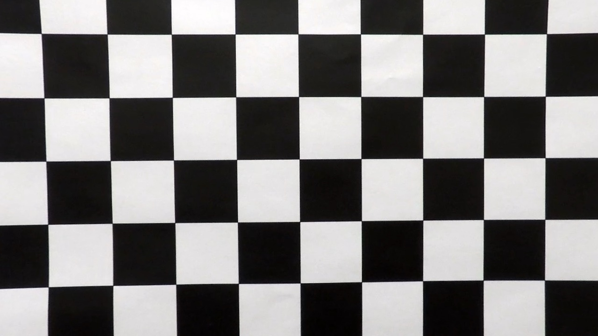
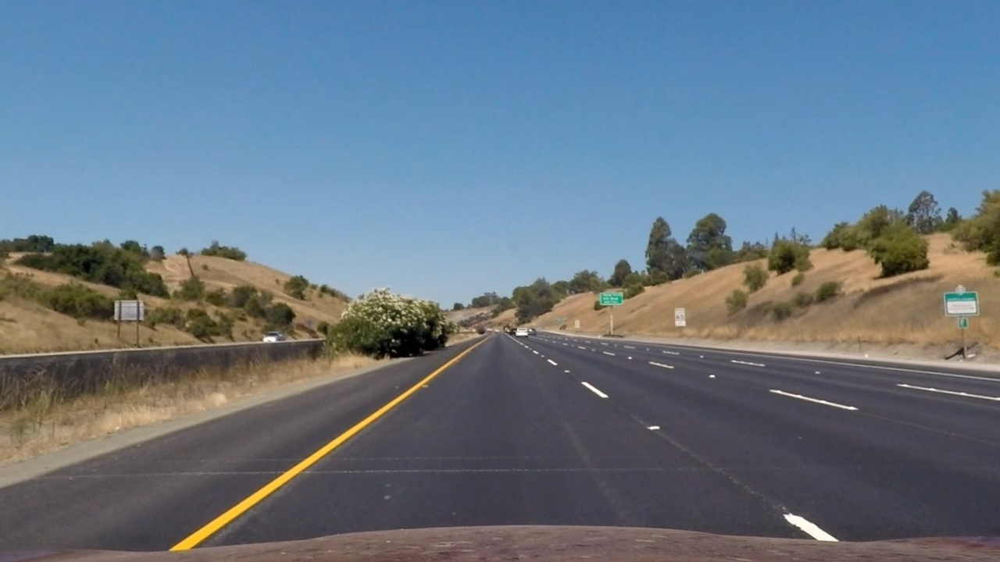
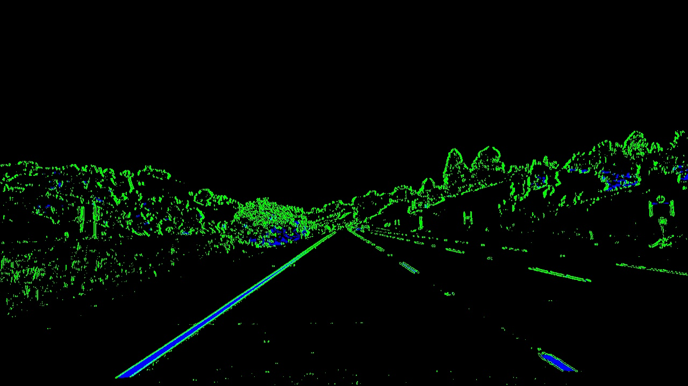
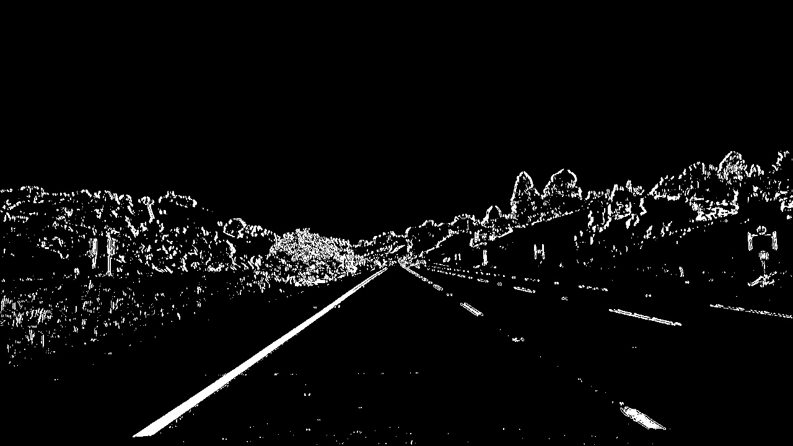
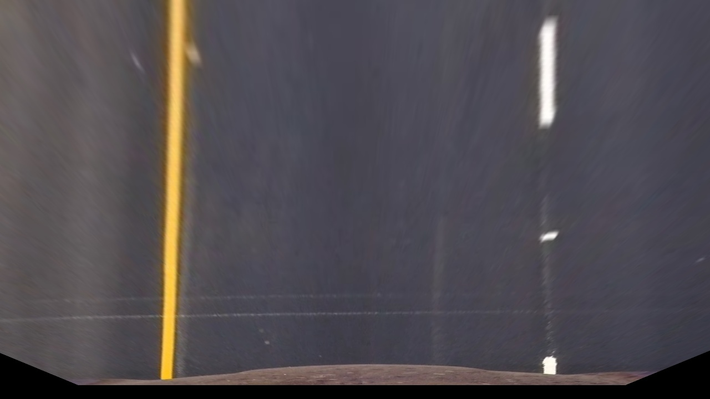
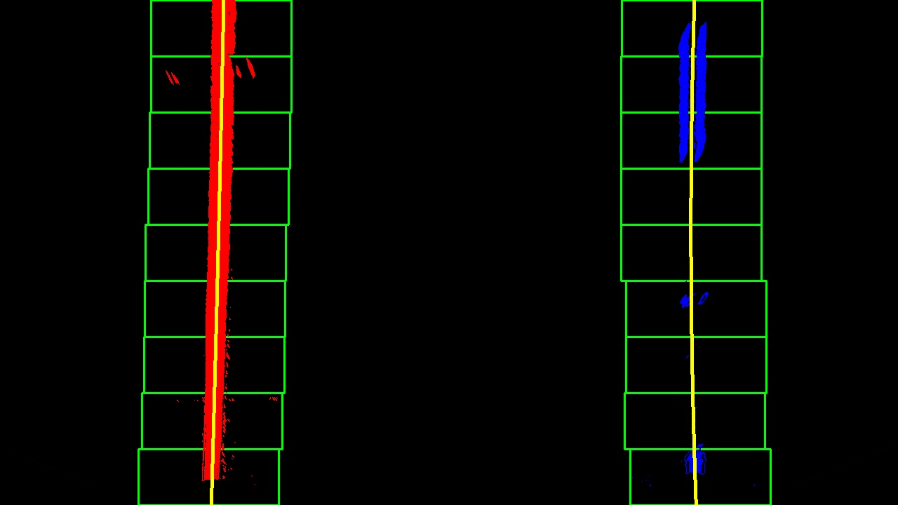
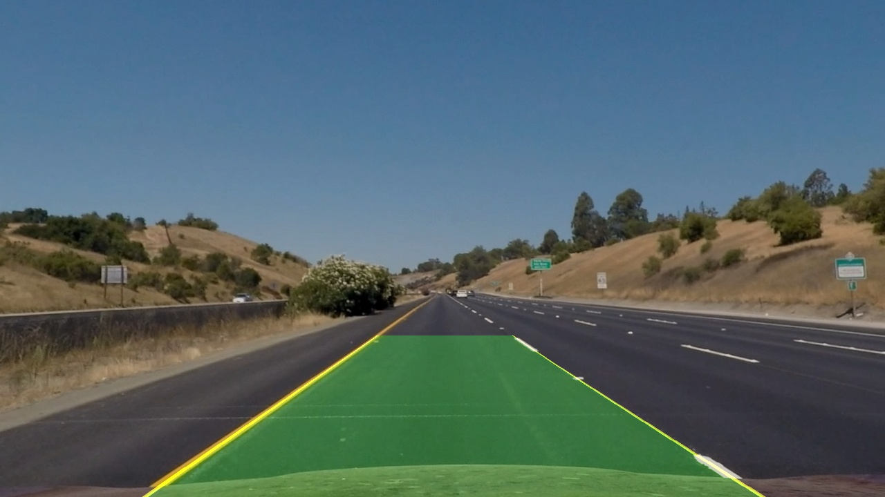

## Writeup

**Advanced Lane Finding Project**

The goals / steps of this project are the following:

* Compute the camera calibration matrix and distortion coefficients given a set of chessboard images.
* Apply a distortion correction to raw images.
* Use color transforms, gradients, etc., to create a thresholded binary image.
* Apply a perspective transform to rectify binary image ("birds-eye view").
* Detect lane pixels and fit to find the lane boundary.
* Determine the curvature of the lane and vehicle position with respect to center.
* Warp the detected lane boundaries back onto the original image.
* Output visual display of the lane boundaries and numerical estimation of lane curvature and vehicle position.

[//]: # (Image References)

[image1]: ./examples/undistort_output.png "Undistorted"
[image2]: ./test_images/test1.jpg "Road Transformed"
[image3]: ./examples/binary_combo_example.jpg "Binary Example"
[image4]: ./examples/warped_straight_lines.jpg "Warp Example"
[image5]: ./examples/color_fit_lines.jpg "Fit Visual"
[image6]: ./examples/example_output.jpg "Output"
[video1]: ./project_video.mp4 "Video"

## [Rubric](https://review.udacity.com/#!/rubrics/571/view) Points

### Camera Calibration

#### 1. Briefly state how you computed the camera matrix and distortion coefficients. Provide an example of a distortion corrected calibration image.

code: under block "Calibration" in notebook lane_detection.ipynb.  

by comparing the iamges points that are detection via cv2.findChessboardCorners and theoratically undistorted points with function cv2.calibrateCamera, we can get the camera metrix and the distortion matrix.

chessboard images after calibration can be found in output_images/calibration.
example:

### Pipeline (single images)

#### 1. Provide an example of a distortion-corrected image.

#### 2. Describe how (and identify where in your code) you used color transforms, gradients or other methods to create a thresholded binary image.  Provide an example of a binary image result.
code: function to_binary under block "Color and Gradien Transformation"
by combining color and gradient thresholds in function to_binary under block "Color and Gradien Transformation" I can get colored and combined binary images

colored binary: 
combined binary: 

#### 3. Describe how (and identify where in your code) you performed a perspective transform and provide an example of a transformed image.
code: to_bev under block "perspective transformation".

I manuelly measured the proportional relationship of four points on the road, could get perspective transformation matrix and bev images with get_src, get_dst and to_bev

example:

#### 4. Describe how (and identify where in your code) you identified lane-line pixels and fit their positions with a polynomial?

code: find_lane_pixels and fit_polynomial under block "fit polynominal". 
By utilizing sliding windown the pixel ids within POI is recorded and makred as lane pixels. with extracted lane point coordinates I could interpolate a quadratic curve.

#### 5. Describe how (and identify where in your code) you calculated the radius of curvature of the lane and the position of the vehicle with respect to center.

code: measure_curvature_pixels function under block "calculate curvature"

#### 6. Provide an example image of your result plotted back down onto the road such that the lane area is identified clearly.

---

### Pipeline (video)

#### 1. Provide a link to your final video output.  Your pipeline should perform reasonably well on the entire project video (wobbly lines are ok but no catastrophic failures that would cause the car to drive off the road!).
you can click on the image to get the video: project_video_output.mp4

### Discussion

#### 1. Briefly discuss any problems / issues you faced in your implementation of this project.  Where will your pipeline likely fail?  What could you do to make it more robust?
when the lane marking is not clear enough, less pixels will be detected in find_lane_pixels, which will make the pipeline not stable. possible solution is to predict lane marking position based on previous frames as additional information input.