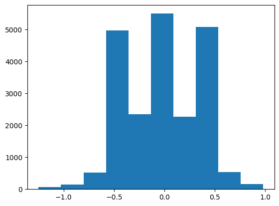
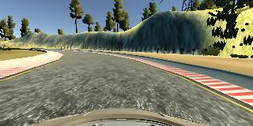
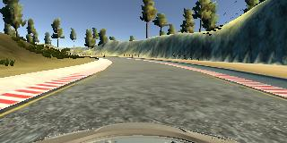
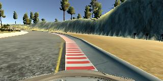
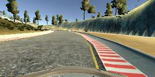
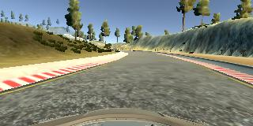
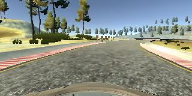
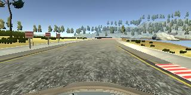

# **Behavioral Cloning** 

### Files Submitted & Code Quality

#### 1. Submission includes all required files and can be used to run the simulator in autonomous mode

The project includes the following files:
* model.ipynb(also exported as model.py) containing the code to create and train the model
* drive.py for driving the car in autonomous mode
* model/model.h5 containing a trained convolution neural network 
* writeup_report.md or writeup_report.pdf summarizing the results

#### 2. Submission includes functional code
with command
```sh
python drive.py model/model.h5
```
the car can run smoothly through track 1

#### 3. Submission code is usable and readable

The model.ipynb (also exported as .py) file contains data loading, data visualization, model design, training codes. excuation logs are kept for tracability.

### Model Architecture and Training Strategy

#### 1. An appropriate model architecture has been employed

Nviadia model with small parameter changes is used. 

| Layer         		|     Description	        					                 | 
|:---------------------:|:---------------------------------------------:                 | 
| Input         		| 160,320,3 RGB image   						                 | 
| Cropping         		| top: 50, bottom: 20   						                 | 
| Nomalization         	| 						                                         | 
| Convolution 5x5     	| 2x2 stride, valid padding, filter depth 24, elu activation     |
| Dropout				| dropout rate 0.2								                 | 
| Convolution 5x5     	| 2x2 stride, valid padding, filter depth 36, elu activation     |
| Dropout				| dropout rate 0.2								                 |
| Convolution 5x5     	| 2x2 stride, valid padding, filter depth 48, elu activation     |
| Dropout				| dropout rate 0.2								                 |
| Convolution 3x3     	| 1x1 stride, valid padding, filter depth 64, elu activation     |
| Dropout				| dropout rate 0.2								                 |
| Convolution 3x3     	| 1x1 stride, valid padding, filter depth 64, elu activation     |
| Dropout				| dropout rate 0.2								                 |
| Fully connected		| output 100        				                             |
| Dropout				| dropout rate 0.5								                 |
| Fully connected		| output 50        				                                 |
| Dropout				| dropout rate 0.5								                 |
| Fully connected		| output 10        				                                 | 
| Dropout				| dropout rate 0.2								                 | 
| Fully connected		| output 1        					                             |


#### 2. Attempts to reduce overfitting in the model
- dropout layer with variable dropout rate
- data augmentation: random flip image, multi-camera

#### 3. Model parameter tuning
epochs size of 30, fine tune epochs size 10, and adam optimizer were utilized

#### 4. Appropriate training data
multiple laps are recorded with different feature representations ( smooth driving, recovery driving, center lane keeping..). All cameras are used in the pipeline, steering angle is compensated for left and right cameras.

### Model Architecture and Training Strategy

#### 1. Solution Design Approach
I started with Nvidia model structure, then after observing some overfitting tendencies I added dropout layer with different dropout rate. The cropping size of input image is also quite important which helps remove disturbing information from training.

#### 2. Final Model Architecture
the final model consist of 5 convolutional layers and 4 fully connected layers, whose parameters can be found in model.py

#### 3. Creation of the Training Set & Training Process
data distribution:


center lane kepping data:



recovery data:




reverse driving data




After the collection process there are totally 22455 data points. these data are splitted to train and validation dataset with ratio of 0.2 after shuffle. in the data generator data batch are cropped (output: (90, 320, 3) ) and normalized. the loss history of training and validation losses are ploted to detect underfit and overfit. first the model is trained with all data, afterwards the model (conv layers are frozen) is fined tuned with high angle data.
