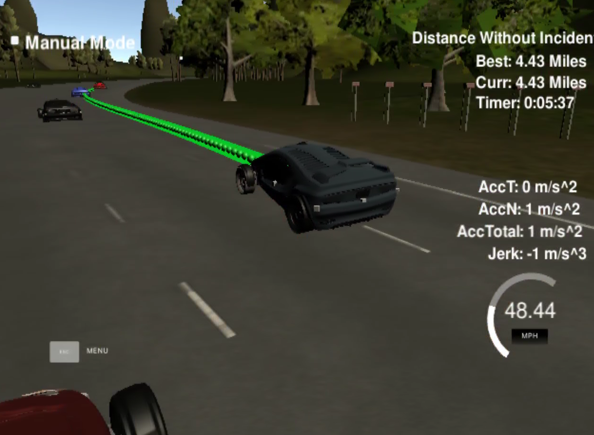

## trajectory generation

1) collision avoidance: check object in the ego lane, if the distance is smaller than 30 m, then set "too_close" to true and change car_status to "PLC"(prepare lane change). during preparation of lane change, the objects on left and right lane are check. As lone as the coresponding lane is free, left lane change is preferred. if lane change is not possible, the speed of ego vehicle will be reduced to the traffic speed.
2) trajectory is smoothed  by considering location points from previous trajectory and applying spline line curv fitting. by increasing the number of points in paths, drivng behavior is stabiler.
