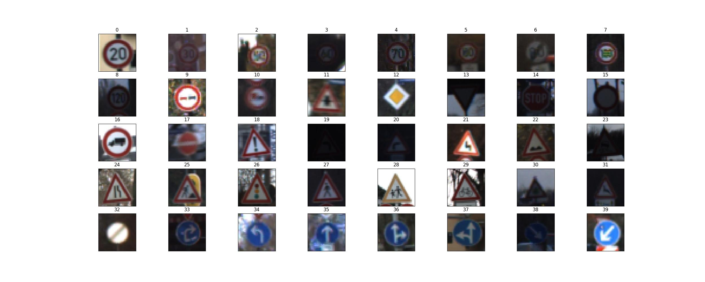
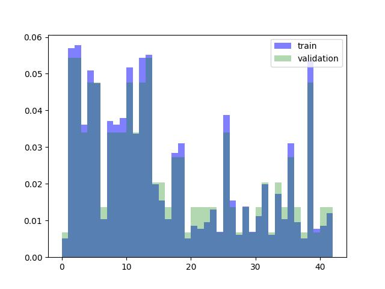
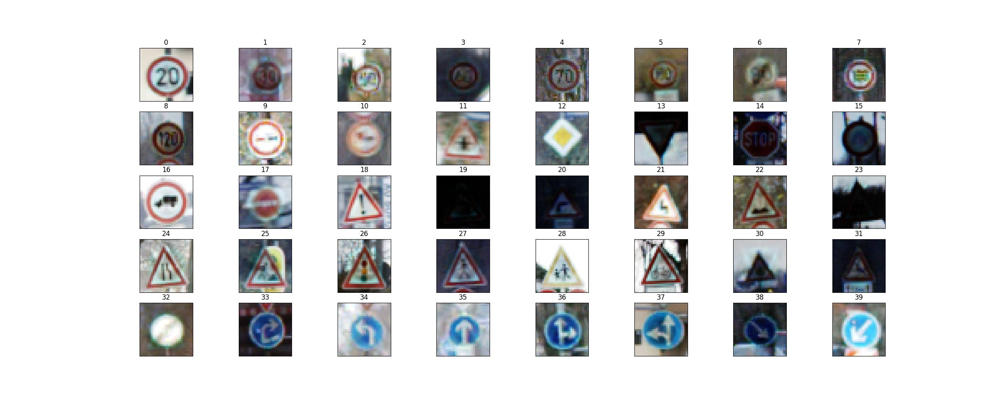
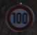
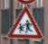
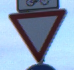
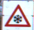
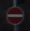

# **Traffic Sign Recognition** 

## Rubric Points

### Data Set Summary & Exploration

#### 1. Provide a basic summary of the data set. In the code, the analysis should be done using python, numpy and/or pandas methods rather than hardcoding results manually.

I used the numpy library to calculate summary statistics of the traffic
signs data set:

* The size of training set is 34799
* The size of the validation set is 4410
* The size of test set is 12630
* The shape of a traffic sign image is (32, 32,3)
* The number of unique classes/labels in the data set is 43

#### 2. Include an exploratory visualization of the dataset.

### Design and Test a Model Architecture

#### 1. Describe how you preprocessed the image data. What techniques were chosen and why did you choose these techniques? Consider including images showing the output of each preprocessing technique. Pre-processing refers to techniques such as converting to grayscale, normalization, etc. (OPTIONAL: As described in the "Stand Out Suggestions" part of the rubric, if you generated additional data for training, describe why you decided to generate additional data, how you generated the data, and provide example images of the additional data. Then describe the characteristics of the augmented training set like number of images in the set, number of images for each class, etc.)

I increased the image contrast with Contrast Limited Adaptive Histogram Equalization (CLAHE)  because the contrast of the original images is low. With normalization the data will be scaled to [0,1], which makes the features in different dimensions comparable and gradient decent faster.

#### 2. Describe what your final model architecture looks like including model type, layers, layer sizes, connectivity, etc.) Consider including a diagram and/or table describing the final model.

I modified the basic model of LeNet 5 to following architecture:

| Layer         		|     Description	        					| 
|:---------------------:|:---------------------------------------------:| 
| Input         		| 32x32x3 RGB image   							| 
| Convolution 3x3     	| 1x1 stride, same padding, outputs 32x32x64 	|
| RELU					|												|
| Max pooling	      	| 2x2 stride,  outputs 16x16x64				    |
| Convolution 3x3	    | 1x1 stride, same padding, outputs 16x16x128   |
| RELU					|												|
| Max pooling	      	| 2x2 stride,  outputs 8x8x128				    |
| Fully connected		| input 8192, output 128        					|
| RELU					|												|
| Fully connected		| input 128, output 43        					|
| RELU					|												|

#### 3. Describe how you trained your model. The discussion can include the type of optimizer, the batch size, number of epochs and any hyperparameters such as learning rate.
Optimizer: Adam Optimizer
batch size: 256
number of epochs: 50
learning rate: 0.001

#### 4. Describe the approach taken for finding a solution and getting the validation set accuracy to be at least 0.93. Include in the discussion the results on the training, validation and test sets and where in the code these were calculated. Your approach may have been an iterative process, in which case, outline the steps you took to get to the final solution and why you chose those steps. Perhaps your solution involved an already well known implementation or architecture. In this case, discuss why you think the architecture is suitable for the current problem.

My final model results were:
* training set accuracy: 100%
* validation set accuracy: 94.9%
* test set accuracy: 84.6%

I first tried the LeNet5 model, but apparently it cannot capture enough features from the images. Then I decreased the converlution kernal size and increase the depth of kernel size, the accuracy increased a lot both by training and validation. With "SAME" padding the information at the boundary of image is kept. With dropout rate of 0.5 the model overfitting problem is resolved.
 

### Test a Model on New Images

#### 1. Choose five German traffic signs found on the web and provide them in the report. For each image, discuss what quality or qualities might be difficult to classify.

Here are five German traffic signs that I found on the web:

the second image is difficult to classify, because the children in the middle of the sign is hardly to recognize.

#### 2. Discuss the model's predictions on these new traffic signs and compare the results to predicting on the test set. At a minimum, discuss what the predictions were, the accuracy on these new predictions, and compare the accuracy to the accuracy on the test set (OPTIONAL: Discuss the results in more detail as described in the "Stand Out Suggestions" part of the rubric).

Here are the results of the prediction:

| Image			        |     Prediction	        					| 
|:---------------------:|:---------------------------------------------:| 
| 100 km/h      		| 100 km/h   									| 
| Children crossing     |Children crossing								|
| Yield					| Yield											|
| Beware of ice/snow	| Beware of ice/snow			 				|
| No entry   			| No entry           							|

The model was able to correctly guess 5 of the 5 traffic signs, which gives an accuracy of 100%, which exceeds the accuracy on test dataset, because test dataset is relatively larger, which could results in more wrong predictions.

#### 3. Describe how certain the model is when predicting on each of the five new images by looking at the softmax probabilities for each prediction. Provide the top 5 softmax probabilities for each image along with the sign type of each probability. (OPTIONAL: as described in the "Stand Out Suggestions" part of the rubric, visualizations can also be provided such as bar charts)

sample 0: predicted label is 7, ground truth label is 7 

   top 0 prob 0.9999998807907104 is : Speed limit (50km/h)

   top 1 prob 7.157892412124056e-08 is : Speed limit (70km/h)

   top 2 prob 4.308780532369383e-08 is : Speed limit (80km/h)

   top 3 prob 5.14795983619365e-09 is : Speed limit (120km/h)

   top 4 prob 1.0885214257738696e-10 is : Speed limit (100km/h)

sample 1: predicted label is 28, ground truth label is 28 

   top 0 prob 0.9999992847442627 is : Dangerous curve to the right

   top 1 prob 6.658984830210102e-07 is : Road work

   top 2 prob 4.664792108144411e-09 is : Bicycles crossing

   top 3 prob 8.766748611777064e-12 is : Beware of ice/snow

   top 4 prob 4.423265573261226e-12 is : Children crossing

sample 2: predicted label is 13, ground truth label is 13 

   top 0 prob 1.0 is : Speed limit (60km/h)

   top 1 prob 3.4404142624117626e-15 is : Speed limit (30km/h)

   top 2 prob 1.075272526162423e-16 is : Priority road

   top 3 prob 5.0026655600985355e-21 is : No vehicles

   top 4 prob 2.1693791013903073e-22 is : Yield

sample 3: predicted label is 30, ground truth label is 30 

   top 0 prob 1.0 is : Bicycles crossing

   top 1 prob 3.028187423037565e-10 is : Right-of-way at the next intersection

   top 2 prob 3.810131724013566e-11 is : Slippery road

   top 3 prob 2.1409296210861406e-11 is : Children crossing

   top 4 prob 2.0850877448241878e-13 is : Beware of ice/snow

sample 4: predicted label is 17, ground truth label is 17 

   top 0 prob 0.9999995231628418 is : Yield

   top 1 prob 4.211927091546386e-07 is : No passing for vehicles over 3.5 metric tons

   top 2 prob 6.988609777686117e-12 is : No passing

   top 3 prob 1.8096665659050881e-12 is : Stop

   top 4 prob 1.128930065749656e-12 is : No entry

