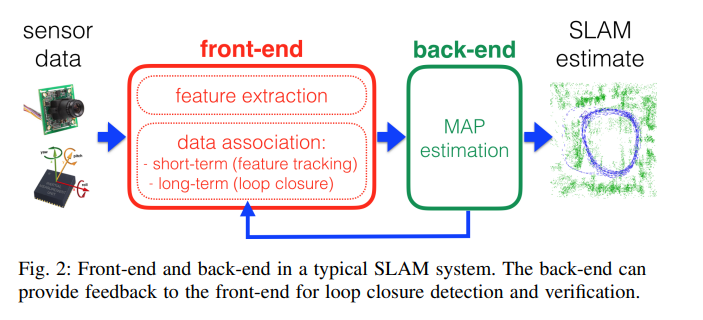

## Self-Driving-Car
### sensor
#### Lidar
- object detection by setting vertical displacement exceeds a given threshold
- object detection by finding points that generate inter-ring distances that differ from the expected distance by more than
a given threshold
- static map: accumulating static data over time into map by only considering teh nearest detected object
- dynamic objects detection: by comparing two consecutive scans the areas of change are detected, which will be recognized as moving objects. teh tracker is initialized using particle filters.
- localization: 1D histogram filter to estimate vehicle's lateral offset relative to map info; the received INS location has to be smoothed with estimated incremental velocity update to avoid coordinate jumps
- navigation: dynamic programming

  - common road navigation: 
    by considering road structure global planner rolls out smoothed center lane and laterally shifted lane. Score of the trajectory is sum of following path cost and cumulative cost
  - free style navigation: 
    generate arbitrary trajectories irrespective of a specific road structure (hybrid A*: 4D[x,y,heading,direction of motion(forward or reverse)]). it is guided by combined heuristics:  non-holonomic-without-obstacles heuristic and the holonomic-with-obstacles heuristic, the maximum of the two is used. the path is further smoothed by a Conjugate Gradient smoother to avoid rapid changes in steering angles.

- Intersection: identify critical zones at intersections (occupied regions near stop signs)


### CV
classical CV: manual feature extraction, poor adaptability to changes in lighting, scale and orientation, interpretable with rule based decision-making, best suited for controlled environments with structured setttings
Deep CV: automatic feature learning, hierarchical feature learning, requires significant power and large datasets, highly adaptable, but less interpretable
#### Calibration
1. asymmetric circle patterns can sometimes yield better results, especially when the camera lens has a high distortion.
2. Take multiple images of the calibration pattern at different angles and distances. The more the variety, the better the calibration, as it will cover more of the camera's field of view.

#### Hough Transformation
if the shape of an aera is known, hough transformation can connect points into boundary lines easily.
1. line in image space is point in hough space
2. point in image space is line in hough space
3. intersected point of lines in hough space is a line that passes through all these points
4. points in image space is lines in hough space that must intersact

#### Gradient
Sobel operator is the heart of canny edge detection. it can calculate in defined direction. with defined threshold of magnitude and direction angle, the target object boundary can be filtered.

#### color
1. color image is represented as a set of 2D arrays, in which each element represents **intensity** of a primary color channel.
2. with matplotlib.image.imread you will get RGB; while with cv2.imread() you will get BGR
3. There is also HSV color space (hue, saturation, and value), and HLS space (hue, lightness, and saturation). 
4. hue represents color independent of any change in brightness; Lightness and Value represent different ways to measure the relative lightness or darkness of a color. For example, a dark red will have a similar hue but much lower value for lightness than a light red. Saturation also plays a part in this; saturation is a measurement of colorfulness. So, as colors get lighter and closer to white, they have a lower saturation value, whereas colors that are the most intense, like a bright primary color (imagine a bright red, blue, or yellow), have a high saturation value.
5. s channel is mostly stable change for lane detection

####  Inverse Perspective Transformation


### Neural Networks
1. AND OR NOT XOR Operation can be expressed by linear Perceptron (weight and bias)
2. In Keras, lambda layers can be used to create arbitrary functions that operate on each image as it passes through the layer.
3. Recently, pooling layers have fallen out of favor. Dropout is a much better regularizer.
4. regularization can be added to all layers' coresponding weights and bias.

#### AlexNet
parallelization of network

#### VGG
a sequence of (3x3 Conv + 2x2 MaxPooling), it uses 224x224 images as input, good for classification transfer learning.
```
from keras.applications.vgg16 import VGG16
img_path = 'your_image.jpg'
img = image.load_img(img_path, target_size=(224, 224))
x = image.img_to_array(img)
x = np.expand_dims(x, axis=0)
x = preprocess_input(x)
model = VGG16(weights='imagenet', include_top=False)
```

#### GoogLeNet
consist of Inception Module, total number of parameters is small

```
from keras.applications.inception_v3 import InceptionV3

model = InceptionV3(weights='imagenet', include_top=False)
```

#### ResNet
architecture is similar to VGG (repetation of layers)
```
from keras.applications.resnet50 import ResNet50

model = ResNet50(weights='imagenet', include_top=False)
```
#### transfer learning

1. Case 1: Small Data Set, Similar Data
slice off the end of the neural network
add a new fully connected layer that matches the number of classes in the new data set
randomize the weights of the new fully connected layer; freeze all the weights from the pre-trained network
train the network to update the weights of the new fully connected layer
2. Case 2: Small Data Set, Different Data
slice off most of the pre-trained layers near the beginning of the network
add to the remaining pre-trained layers a new fully connected layer that matches the number of classes in the new data set
randomize the weights of the new fully connected layer; freeze all the weights from the pre-trained network
train the network to update the weights of the new fully connected layer
3. Case 3: Large Data Set, Similar Data
remove the last fully connected layer and replace with a layer matching the number of classes in the new data set
randomly initialize the weights in the new fully connected layer
initialize the rest of the weights using the pre-trained weights
re-train the entire neural network
4. Case 4: Large Data Set, Different Data
remove the last fully connected layer and replace with a layer matching the number of classes in the new data set
retrain the network from scratch with randomly initialized weights
alternatively, you could just use the same strategy as the "large and similar" data case

### Kalman Filter

x: state matrix; F: transition matrix; P: state covariance matrix; Q: process covariance matrix;z: measurement vector;H: projection matrix;R: measurement noise covariance matrix;
The measurement update for lidar will also use the regular Kalman filter equations, since lidar uses linear equations. Only the measurement update for the radar sensor will use the extended Kalman filter equations.
1. Kalman Filter
2. Extended Kalman Filter
use first order taylor expansion (jacobian matrix) to extimate nonlinear transformation (from state space to measurement space in measurment update step).  
in practice for the first step in update, use the h function directly to map predicted locations x from Cartesian to polar coordinates, instead of Jacobian matrix.
3. Unscent Kalman Filter
to tacle nonlinear problem in prediciton step by using sigma points to represent normal distribution. number of sigma points is determined by augmented state vectors
#### MatrixXd and VectorXd
VectorXd: 1D
MatrixXd: multi dimension

#### sensor fusion precedure 

- first measurement - the filter will receive initial measurements of the bicycle's position relative to the car. These measurements will come from a radar or lidar sensor.
- initialize state and covariance matrices - the filter will initialize the bicycle's position based on the first measurement.
then the car will receive another sensor measurement after a time period Δt.
- predict - the algorithm will predict where the bicycle will be after time Δt. One basic way to predict the bicycle location after Δt is to assume the bicycle's velocity is constant; thus the bicycle will have moved velocity * Δt. In the extended Kalman filter lesson, we will assume the velocity is constant.
- update - the filter compares the "predicted" location with what the sensor measurement says. The predicted location and the measured location are combined to give an updated location. The Kalman filter will put more weight on either the predicted location or the measured location depending on the uncertainty of each value.

## Localization
*  Belief = probability
* sense = product followed by normalization
* move = convolution(addition)

1D markov localization(also called histogram filter), Kalman Filters and Particle Filters are Realizations of Bayes Filter.
localization uses map coordinate, and kalman filter uses vehicle coordinate. 


### 1D Markov model
assumption
-  future states (the next state) is dependent only upon the current state and not on other preceding states
- all observations are independent


recursive structure

1. Motion model ->prediction step
$$ p(x_t|x_{t-1}^{(i)}, \mu_t,m) = \sum p(x_t|x_{t-1}^{(i)}, \mu_t, m)bel(x_{t-1}^{(i)}) $$
$$ \mu: control parameter (yaw, pitch, roll rates, velocity)$$
$$ m: map(grid maps, feature maps) $$ 
2. observation model -> update step
$$ p(z_t|x_{t}, z_{1:t-1}, \mu_{1:t},m) = p(z_t|x_{t}, m) $$
--> Markov localization
$$ bel(x_t) = \eta p(z_t|x_{t},m)*\hat{bel}(x_t) $$

#### Implementation steps
- extract sensor observations
    * for each pseudo-position:
        + get the motion model probability
        + determine pseudo ranges
        + get the observation model probability
        + use the motion and observation model probabilities to calculate the posterior probability
- normalize posteriors (see helpers.h for a normalization function)
- update priors (priors --> posteriors)
### particle filters


#### bike motion model

#### coordinate system

#### localization signal
road reflectivity(lane marking) and curb like obstacle

### SLAM

SLAM aims at building a globally consistent representation of the environment, leveraging both ego-motion measurements and loop closures(place recognition). by finding loop closures, the robot understands the real topology of the environment, and is able to find shortcuts between locations. the metric information avoid t wrong data
association and perceptual aliasing.
- front end: extracts relevant features from the sensor data and associating each measurement to a specific
landmark (say, 3D point) in the environment(data association)
    * short term association: track measurements in consecutive frames
    * long term association: associating new measurements to older landmarks
- Maximum a posterior (MAP):  unlike Kalman filtering, MAP estimation does not require an explicit
distinction between motion and observation model: both models are treated as factors and are seamlessly incorporated in the estimation process(factor graphs).
#### representation
1) matric map mdoels(recognizing a previously seen place)
- 2D: landmark-based maps and occupancy grid maps
- 3D: landmark-based representations(point features, lines, segments, arcs), Low-level raw dense representations(point cloud, polygons), Boundary and spatial-partitioning dense representations(voxels, octree), High-level object-based representations
2) semantic map models(classifying the place according to semantic labels)
still has problem in utilizing semantic-based reasoning

## path planning
### search
1. A* search
2. dynamic proggramming
try to find some technics !!

### prediction
frenet coordinates

#### clusering
cluster trajectory into 12 (4stops * 3 actions) groups at intersection
1) Agglomerative Clustering
2) spectral clustering
#### prediction approach
1) model based 
* identify common driving behaviors(change lane, turn lef, cross street, etc..)
* define process model for each behavior
* update beliefs by observation
* generate new trajectory
2) data driven
* offline training:unsupervised clustering and define prototype trajectories
* online prediction: make prediction based on partial trajectory
#### naive bayes
"naive" is because features contribute independently.
Gaussian Naive Bayes: individual probalities have gaussian distributions

### behavior control
#### finite state machine
suitable for small state space, such as high way driving; should need other approaches in complex scenarios, such as urban driving.
stuckness detector will trigger exceptional state through waiting timeout or through repeated traversal of a location to overcome stuckness.

### Navigation
#### Methods
1) potential field methods
2) combinatorial methods
3) sampling based methods
* discrete methods: A*, D*, D*-lite, Dijkstra's, ARA*
* probabilistic methods: RRt, RRT*, PRM
##### Hybrid A* 
it is a free-form planer, consider the kinodynamics of vehicle besides the position, which makes the trajectory is drivable. used for parking lots and certain traffic maneuvers such as U turns.
##### Trajectory Generation
1) Polynominal Trajectory Generation
- minimazation of jerk for comfort:  the higher degree item of taylor polynominal expansion than 6 should be 0.
- feasibility: acceleration, velocity, turn rate.
- cost function consider: jerk(longituditional, lateral), distance to obstacles, distance to center line, time to goal.

### controll
1) MPC controller
2) PID controller
#### PID controller
$$ \alpha = -\tau_p*CTE -\tau_D*\frac{dCTE}{dt}-\tau_I\sum{CTE}$$
1. P component: proportional minimize oscillation
2. D component: monitor the ramp rate of the process value, and prevent it from overshooting the set point
3. I component: to achieve an adequate response or reaction time
 
##### Twiddle parameter optimization
```
def twiddle(tol=0.2): 
    p = [0, 0, 0]
    dp = [1, 1, 1]
    robot = make_robot()
    x_trajectory, y_trajectory, best_err = run(robot, p)

    it = 0
    while sum(dp) > tol:
        print("Iteration {}, best error = {}".format(it, best_err))
        for i in range(len(p)):
            p[i] += dp[i]
            robot = make_robot()
            x_trajectory, y_trajectory, err = run(robot, p)

            if err < best_err:
                best_err = err
                dp[i] *= 1.1
            else:
                p[i] -= 2 * dp[i]
                robot = make_robot()
                x_trajectory, y_trajectory, err = run(robot, p)

                if err < best_err:
                    best_err = err
                    dp[i] *= 1.1
                else:
                    p[i] += dp[i]
                    dp[i] *= 0.9
        it += 1
    return p
```

### System intergration
#### perception

#### planning
The major components of the planning subsystem components are route planning(high level of what path to take on map), prediction(predict other objects' behavior), behavioral planning(define the action to take of ego-vehicle), and path planning(generate trajectory for execuation).
#### ros
ros is amazing tool (ranging version: from  hydro, indigo, Jade until now kinetic)
1) master node server acts central repository for parameters; 
2) any node can publish and subscribee to any topic (topic is based on pub-sub architecture).
3) service use request-response message passing schema

##### catkin ws
```
catkin_init_workspace
catkin_make
```
to create a package
```
catkin_create_pkg <your_package_name> [dependency1 dependency2 …]
```

##### rqt_graph
it can be used to show graph architecture of ros nodes system
##### command
```
rosnode list
rostopic list
# get topic pub sub information
rostopic info <topic-name>
# get message type informaiton
rosmsg info <msg-type>
# check rostopic data
rostopic echo <topic-name>
# make service call
rosservice call /arm_mover/safe_move "joint_1: 1.57
# set ros parameter
rosparam set /arm_mover/max_joint_2_angle 1.57
# check and install dependencies
rosdep check <package name>
rosdep install -i < package name>
```
rosrun can run execuable without go into the folder; roslauch can launch multi ros node with one command line.
##### msg type
the std_msgs package contains all of the basic message types, and message_generation is required to generate message libraries for all the supported languages (cpp, lisp, python, javascript).
message in defined under folder msg with extension of .msg.
Service is defined under srv folder with extension .srv in two sections: one for request message, and another for response message, they are  seperated by dashed line.
##### visualization
``` 
#view camera image
rqt_image_view /rgb_camera/image_raw

```
##### logging
logs can be found in ~/.ros/log or ROS_ROOT/log
```
rospy.logdebug(...)
rospy.loginfo(...)
rospy.logwarn(...)
rospy.logerr(...)
rospy.logfatal(...)
```
The loginfo messages are written to Python's stdout, while logwarn, logerr, and logfatal are written to Python's stderr by default. Additionally, loginfo, logwarn, logerr, and logfatal are written to /rosout.


## Tools
### interactive widgets
https://github.com/jupyter-widgets/ipywidgets

